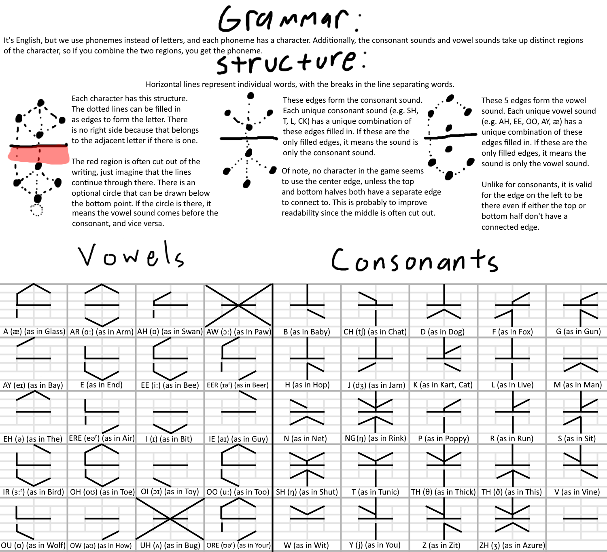

# Tunic texting app

### what is tunic? 
Tunic is an amazing game: https://store.steampowered.com/app/553420/TUNIC/
Please do not interact with this application or documentation if you are avoiding spoilers for Tunic

Tunic has many puzzles which can be answered with knowledge of the tunic writing system. It is a rune based system, 
using a subset of the IPA (internation phonetic alphabet) represented as combined runes.

A rune consists of 3 main elements. 
A core, consisting of up to 6 lines radiating from a central point. Each line can either
exist or be absent, and each combination of existing and absent lines has the potential to correspond to a consonant. 
Many theoretical combinations are unused and are thus invalid.

A shell, in the shape of a hexagon but missing it's rightmost line. As with the core, it consists of a collection of lines,
each of which can be present or omitted and each combination has the potential to code for a vowel or combined vowel.
In practice there are a few combinations which are invalid and have no corresponding vowel. 

A dot, located at the bottom vertex of the symbol, which if present means that the vowel will be pronounced before the consonant, 
and if absent that the consonant will be pronounced before the vowel.

This app uses a font that applies the rules of the tunic writing system using ligatures, wherein the combination of two
characters creates altered symbols. In english, this is often used to adjust the spacing between letters to appear more natural.
However, it allows consonants and vowels and dots to be overlayed according to these rules

The one rule that can cause confusion using this app is that if you enter a rune that consists of, for instance, a consonant with no vowel,
and then the next rune is a vowel with no consonant, they will be combined when displayed. This may be unexpected, but it is correct, as
two half runes in that order would not be valid. 



## that's cool but how do I text people with that?
The core feature of this application is that you get to use your choice of keyboard to enter tunic runes into messages and then send them.
Right now they get sent to a central chat room with no support for direct messaging or accounts or anything like that. 

The two keyboards are the toggleboard, which has buttons laid out in the approximate shape of a tunic runes, allowing you to enter
combinations of core/shell/modifier elements with toggles, and the phoneme board which simply offers a list of all consonants and vowels
and allows you to pick them, more like an english keyboard. 

The app was mostly intended to be used on a phone although it works just as well with a mouse. Currently there is no support for
using a keyboard as an input device


## local TLS setup
use ```openssl req -newkey rsa:2048 -new -nodes -x509 -days 3650 -keyout key.pem -out cert.pem``` in the base source directory to generate the self signed cert

## project layout
the frontend is currently served by the go server, at port 3000. 
There are currently two keyboards, both in components

## todo
maybe add a toggle to hide flashcard component and help text? For experienced users
set toggle values to localstorage
do I want accounts? Doing so would require a database
if I want accounts do I need to set up different chat rooms? Friends? Etc
push notifications
websockets to replace polling
